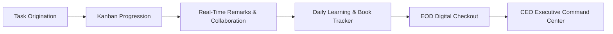

# UrbanGaon Workspace — Executive Architecture & Flow Guide
**Real-Time Workforce & Task Operations Platform**

---

---


## 1. Executive Summary: Why This System Exists

In fast-scaling companies, operational delay and confusion almost never occur from a lack of talent or hard work. Rather, they stem from **fragmented communication, unaligned priorities, and invisible daily bottlenecks**.

### The Problem We Solved
- **Scattered Communication:** Work was previously discussed across WhatsApp chats, casual conversations, and verbal standups where commitments were easily forgotten.
- **Constant Status Inquiries:** Leadership had to constantly ask *"What is the status of Task X?"* and *"What did we accomplish today?"*.
- **Delayed Discovery of Blockers:** Roadblocks that could be solved in 5 minutes by the CEO were discovered 2 to 3 days late during reviews.

### The Solution: UrbanGaon Real-Time Workspace
This platform establishes a **single source of truth** across all 9 team members. Every commitment, project milestone, daily task, and end-of-day summary is visible in real-time. The CEO has 100% operational transparency with zero manual follow-ups needed.



---

## 2. User Roles & Access Hierarchy

To ensure transparency without causing information overload or peer distractions, the system implements a strict two-tier access architecture:

| Feature / Capability | 👑 Executive & Leadership Tier (CEO & Management) | 👤 Team Member Tier (Execution Team) |
| :--- | :--- | :--- |
| **Visibility Scope** | **360° Company-Wide:** All 9 members' boards & tasks | **Focused Personal Workspace:** Own tasks only |
| **Privacy Protection** | Unrestricted access across the company | Built-in Privacy Lock preventing peer snooping |
| **Task Management** | Create, reassign, change status, edit, or delete any task | Create & manage personal assigned tasks |
| **Direct Status Override** | Yes (Direct executive dropdown in CEO table) | Move tasks via Drag & Drop on Kanban Board |
| **EOD Audit & History** | Review all submitted EOD reports & day ratings | Submit mandatory EOD checkout before clocking out |
| **Executive Reports** | 1-Click Export to PDF & CSV anytime | View own performance |
| **Book Reading Tracker** | Company-wide velocity, pages read & insights audit | Daily page logging & takeaway journaling |

---

## 3. End-to-End Operational Application Flow

The system functions like a streamlined assembly line for daily work. Here is how a task flows from start to finish:

### Stage 1: Task Origination & Delegation
1. The CEO, manager, or member clicks **"+ Create Task"**.
2. A comprehensive task card is established with:
   - **Title & Description:** Clear deliverables.
   - **Assignee:** Any of the 9 team members.
   - **Priority Level:** Urgent (Red), High (Amber), Medium (Blue), or Low (Slate).
   - **Due Date:** Target completion date.
   - **Tags & Subtasks:** Step-by-step checklist of sub-deliverables.
3. The moment the task is saved, it **instantly appears on the assignee's screen** across the office with an audio notification chime. No page refresh is required.

### Stage 2: The 4-Stage Kanban Board (Drag & Drop)
Tasks progress visually through 4 distinct stages:
1. 📋 **To Do:** Backlog and ready-to-start tasks.
2. ⚡ **In Progress / Review:** Tasks actively being executed right now.
3. 🛑 **Blocked:** Tasks stopped due to external dependencies or needing CEO approval.
4. ✅ **Completed:** Fully delivered work.

> **Visual Drag & Drop:** Team members simply grab a card and drop it into the next column as their work advances.

### Stage 3: Real-Time Remarks & Notes (Zero Context Loss)
- Every card includes a dedicated **💬 Remarks** button.
- Team members and leadership can leave time-stamped comments, client feedback, file references, or updates.
- This creates a permanent, searchable audit trail right inside the task, eliminating chaotic message threads on WhatsApp.

### Stage 4: Automated Overdue Detection & Calendar View
- If a task exceeds its due date without completion, the platform automatically tags it with a bright **🔥 Overdue** badge.
- Overdue tasks are automatically floated to the top of both the team board and the CEO Command Center.
- Leadership can switch to **Calendar View** to see deadlines plotted across the entire month.

### Stage 5: Real-Time Celebration & Broadcast
- When a member drags a task to **Completed**, celebratory confetti fires on their screen with an accomplishment chime.
- The company-wide **Live Activity Feed** immediately broadcasts: *"Team Member completed 'Design System Architecture'"*.

---

## 4. The Daily Book Reading & Intellectual Growth Engine

A unique pillar of UrbanGaon's culture is that professional reading and leadership development are tracked alongside daily tasks.

### How Daily Reading Works:
1. **Registered Book:** Each team member registers the book they are currently reading along with the author and total page count.
2. **Daily Check-In Modal:** Every day, members log:
   - Pages read today (e.g. `+20 pages`).
   - **Key Takeaways:** A written synthesis of the core insight or business principle learned.
3. **Company Presentations:** Once finished, the book is marked as "Presented" after sharing the lessons with the entire team during internal knowledge-sharing sessions.
4. **CEO Reading Velocity Dashboard:**
   - Real-time tracker showing: *⚡ Read Today: 7/9 Active Members* and *📖 Today's Output: +185 pages*.
   - 6 KPI cards tracking total books, finished books, books currently being read, presented titles, total company pages, and overall percentage completed.
   - 1-click **Reading Logs History** to inspect any member's past takeaways.

---

## 5. Daily EOD (End-Of-Day) Checkout System

At the end of the working day, team members do not simply log off. They complete an **End-of-Day Checkout** that enforces daily accountability and alignment.

### The 4-Step EOD Ritual:
1. **Task Aggregation:** The system automatically lists every task completed today and every task that remains pending.
2. **Pending Task Explanation:** For any task that was not finished, the member must provide:
   - Reason for delay.
   - The concrete plan to tackle it tomorrow morning.
3. **Blockers & Hours Worked:** The member documents any external blockers faced and logs their total working hours for the day.
4. **Day Rating (1 to 5 Stars ⭐):** The member rates their daily productivity and sentiment.

### What Happens Upon Submission:
- The member's status immediately switches to **🏠 Clocked Out**.
- The full EOD report is immediately filed into the **CEO Command Center** and the **EOD Reports Hub**.
- The CEO can review the daily digest in under 2 minutes every evening.

---

## 6. The CEO Executive Command Center

By clicking **"Executive Command"** in the top navigation, the CEO accesses the master management cockpit designed for quick executive oversight:

### 1. Four High-Level KPI Cards
- **Total Team Members:** Headcount and count of active team members currently working online.
- **Active Pending Tasks:** Immediate tally of all unfinished work across the entire company.
- **Sprint Completion Rate:** Percentage and count of completed tasks.
- **EOD Checkouts Today:** Proportion of team members who have clocked out with their daily report.

### 2. Master Task Control Matrix
- **Search & Filter:** Search by task name, tag, or filter by team member.
- **1-Click Status Tabs:** Instantly isolate *All*, *Pending Active*, *🔥 Overdue*, *To Do*, *In Progress*, *Blocked*, or *Completed*.
- **Direct Status Modification:** Change any task's status on the fly via a direct dropdown.
- **Quick Remarking:** Add leadership notes directly into any member's card.

### 3. Team Workload & Attendance Table
- Lists all 9 members with their real-time presence (Active Now / Clocked Out / Offline).
- Displays individual task completion counts and pending workload.
- **"View EOD Report" button:** Opens the member's complete daily checkout form.
- **"Open Board" button:** Instantly opens that member's personal Kanban board.

### 4. One-Click Corporate Exports
- **Export PDF:** Generates a publication-ready, branded workforce summary PDF for records or board meetings.
- **Export CSV:** Exports complete tabular workforce data for Excel or Google Sheets.

---

## 7. System Architecture (Simplified for Non-Technical Leaders)

The platform is engineered using modern enterprise standards:

```
[ Team Member Laptops ] <─── (Instant WebSocket Sync) ───> [ UrbanGaon Cloud Server ]
[ CEO Laptop / iPad   ] <─── (Instant WebSocket Sync) ───> [ MongoDB Enterprise DB ]
```

1. **Instant WebSocket Hub (Socket.IO):** All connected devices share a live sync channel. When someone drags a card or adds a remark, the update appears on the CEO's screen within **100 milliseconds without refreshing**.
2. **Crash-Proof MongoDB Database:** Automatic data persistence ensures that even if a laptop loses power or internet drops, every task and note is preserved.
3. **Immutable Live Activity Feed:** Every single create, edit, move, remark, and checkout action is timestamped and logged with the author's name. Nothing can be altered secretly.

---

## 8. Strategic Business Value & Leadership ROI

| Strategic Objective | Traditional Office Reality | With UrbanGaon Task Dashboard |
| :--- | :--- | :--- |
| **Status Transparency** | 30-45 minutes wasted daily in sync calls | **0 minutes** — Everything is live 24/7 |
| **Blocker Resolution** | Discovered days late during reviews | **Instant** — Blocked tasks flag red on CEO screen |
| **Accountability** | Relies on memory and subjective claims | **Objective** — EOD checkout with metrics & logs |
| **Company Culture** | Reading encouraged but never measured | **Integrated** — Daily page tracking & presentations |
| **Executive Agility** | CEO must micromanage or remain in the dark | **Fingertip Control** — Full oversight in 5 min/day |

---

### Summary for CEO Review
> *"The UrbanGaon Task Operations Dashboard transforms daily business from reactive management into a disciplined, high-velocity machine. It empowers team members with clarity and autonomy, while providing the CEO with total visibility, peace of mind, and objective proof of daily progress."*
