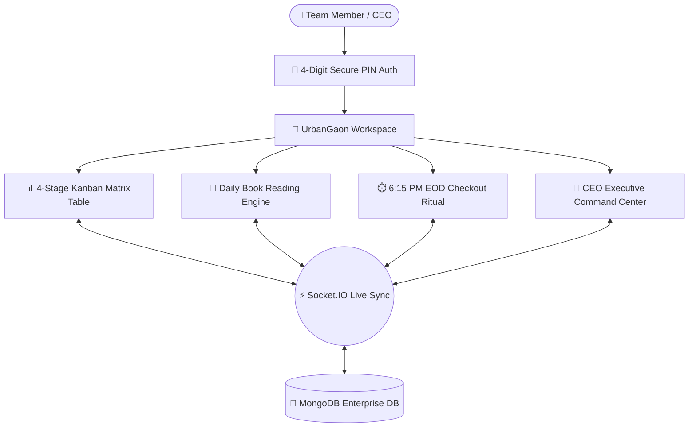

# 📘 UrbanGaon Team Operations Dashboard — Master Project Documentation

> **Real-Time Workforce, Task Kanban Matrix & Executive Operations Platform**  
> *Engineered for UrbanGaon with SDE-3 Enterprise Standards & Executive Governance.*

---

## 📑 Table of Contents
1. [Executive Overview & Vision](#1-executive-overview--vision)
2. [Core Architecture & Tech Stack](#2-core-architecture--tech-stack)
3. [Project Directory Structure](#3-project-directory-structure)
4. [User Roles & Security Hierarchy](#4-user-roles--security-hierarchy)
5. [End-to-End Operational Flows](#5-end-to-end-operational-flows)
   - [Flow A: Authentication & Presence Heartbeat](#flow-a-authentication--presence-heartbeat)
   - [Flow B: Task Lifecycle & 4-Stage Kanban Matrix](#flow-b-task-lifecycle--4-stage-kanban-matrix)
   - [Flow C: Date-Wise Column Sectioning](#flow-c-date-wise-column-sectioning)
   - [Flow D: Sticky Freeze Header Navigation](#flow-d-sticky-freeze-header-navigation)
   - [Flow E: Remarks & Collaboration Audit Trail](#flow-e-remarks--collaboration-audit-trail)
   - [Flow F: Intellectual Growth & Book Reading Tracker](#flow-f-intellectual-growth--book-reading-tracker)
   - [Flow G: End-of-Day (EOD) Checkout & Policy Lock](#flow-g-end-of-day-eod-checkout--policy-lock)
   - [Flow H: Real-Time WebSocket Synchronization Hub](#flow-h-real-time-websocket-synchronization-hub)
   - [Flow I: CEO Executive Command Center](#flow-i-ceo-executive-command-center)
6. [Database Schema & Data Models](#6-database-schema--data-models)
7. [API Endpoints & WebSocket Events](#7-api-endpoints--websocket-events)
8. [Setup, Execution & Deployment Guide](#8-setup-execution--deployment-guide)
9. [FAQ & Troubleshooting](#9-faq--troubleshooting)

---

## 1. Executive Overview & Vision

### The Problem We Solved
Before this platform, fast-growing startup teams faced daily friction:
- **WhatsApp Chaos:** Important tasks and client requirements were lost in chat groups.
- **Micro-Management Overhead:** Leadership had to repeatedly ask *"What is the status of Task X?"* and *"What did you complete today?"*.
- **Hidden Roadblocks:** Critical blockers were discovered days late during casual conversations.
- **Unmeasured Personal Growth:** Book reading and skill development were encouraged but never tracked or shared.

### The Solution: UrbanGaon Operations Dashboard
A **unified, real-time enterprise workspace** connecting all 9 team members and the CEO under one operational roof:
- **Zero Follow-Ups:** Real-time visibility of every task across all 9 members.
- **Sub-100ms Live Sync:** Instant screen updates via WebSockets when any task is updated, remarked on, or completed.
- **Strict Accountability:** 6:15 PM End-of-Day Checkout enforcing daily handovers and next-day planning.
- **Culture of Reading:** Built-in tracker measuring pages read, key takeaways, and team presentations.



---

## 2. Core Architecture & Tech Stack

The platform is designed with a **hybrid enterprise architecture** combining Next.js with a dedicated Node.js HTTP/WebSocket server:

| Layer | Technology | Responsibility |
| :--- | :--- | :--- |
| **Frontend Framework** | **Next.js 14 (Pages Router)** & React 18 | High-performance client rendering, optimized page transitions, and responsive UI. |
| **Styling & Design System** | **Tailwind CSS + Vanilla CSS Tokens** | Tailored corporate aesthetics, custom scrollbars, and zero-horizontal-scroll matrix layouts. |
| **Iconography & Visuals** | **Lucide React** | Clean, minimalist corporate icons. |
| **Custom Backend Server** | **Node.js HTTP Server (`server.js`)** | Unified process handling Next.js rendering, REST API fast-path, and Socket.IO. |
| **Real-Time Engine** | **Socket.IO 4.x** | Sub-100ms bi-directional events for instant multi-user synchronization. |
| **Database & ODM** | **MongoDB + Mongoose 9.x** | Resilient document persistence with automatic fallback to JSON backup (`data/database.json`). |
| **Audio Feedback Engine** | **HTML5 Web Audio API (`lib/audio.js`)** | Subtle tactile sounds for clicks, task completions, and modal actions. |
| **Reporting & Exports** | **jsPDF + AutoTable** | 1-Click branded corporate PDF and CSV workforce reports. |

---

## 3. Project Directory Structure

```
d:\TODO Dashboard\
├── components/                 # Reusable UI Component Library
│   ├── auth/                   # Authentication screens & PIN modals
│   │   └── AuthScreen.jsx      # Member selection & 4-digit PIN authentication
│   ├── dashboard/              # Executive cockpit widgets
│   │   ├── CEODashboard.jsx    # Master command center for Aakash Das (CEO)
│   │   └── EODReportsHub.jsx   # Historical audit of submitted daily checkouts
│   ├── layout/                 # Global application framing
│   │   ├── Header.jsx          # Classic header component
│   │   ├── Sidebar.jsx         # Left navigation, member filter, reading status
│   │   └── TopNavbar.jsx       # Fixed 56px sticky top bar with global search & EOD
│   ├── modals/                 # Application dialogs & workflow modals
│   │   ├── DailyReadingModal.jsx # Daily book pages read & takeaways logger
│   │   ├── EODCheckoutModal.jsx  # Clean corporate EOD checkout dialog
│   │   ├── TaskModal.jsx         # Task creation and comprehensive editor
│   │   └── TaskRemarkModal.jsx   # Dedicated task comment & audit log modal
│   ├── tasks/                  # Task board views and card elements
│   │   ├── CalendarView.jsx    # Month-grid deadline calendar view
│   │   ├── KanbanBoard.jsx     # Master 4-Status spreadsheet matrix board
│   │   └── TaskCard.jsx        # Individual draggable task card
│   └── index.js                # Clean barrel exports for components
│
├── config/                     # Application configurations & constants
│   └── constants.js            # Storage keys, shifts timings, and defaults
│
├── data/                       # Local offline fallback database
│   └── database.json           # File-backed JSON snapshot for offline resilience
│
├── docs/                       # Official System Documentation
│   ├── CEO_DOCUMENTATION.md    # High-level business overview for leadership
│   └── PROJECT_MASTER_DOCUMENTATION.md # Complete end-to-end technical guide
│
├── hooks/                      # Custom React Hooks
│   ├── useAuth.js              # Authentication state, login, logout, and token cache
│   └── useSocket.js            # Real-time Socket.IO synchronization hook
│
├── lib/                        # Backend Helpers & Shared Utilities
│   ├── audio.js                # Enterprise sound library (clicks, fanfare, delete)
│   ├── db.js                   # Mongoose connection, memory fallback, sanitizers
│   ├── models/                 # Mongoose Schemas (User, Task, EODReport, ActivityLog)
│   └── timeUtils.js            # Shift validation and 6:15 PM lockout calculations
│
├── pages/                      # Next.js Pages & API Endpoints
│   ├── _app.jsx                # Global application wrapper with global CSS
│   ├── _document.jsx           # HTML head, typography, and meta tags
│   ├── index.jsx               # Master dashboard page mounting Sidebar & Board
│   └── api/                    # REST API endpoints (tasks, users, reports, overview)
│
├── server/                     # Backend Modular Middleware & Socket Handlers
│   ├── middleware/             # Security headers, gzip compression, body parser
│   └── socket/                 # Socket.IO modular event handlers
│       ├── handlers/           # Modular task, presence, and EOD socket handlers
│       └── index.js            # WebSocket hub initialization
│
├── styles/                     # Stylesheets
│   └── globals.css             # Tailwind directives, custom scrollbars, and glass classes
│
├── package.json                # Project dependencies and operational scripts
└── server.js                   # Master application entry point
```

---

## 4. User Roles & Security Hierarchy

The platform manages **9 official team members** with distinct role permissions:

```
👑 Executive Tier (CEO / Admin): Aakash Das (usr_aakash)
   └── Full 360° visibility over all 9 boards, direct status dropdowns, 
       CEO instant EOD time-override, and full PDF/CSV export controls.

👤 Team Member Tier (8 Members):
   Shyamsundar Varma, Yudhister Tiwari, Dr Rekha Pareek, Sanjay, 
   Ayaz, Utkarsh, Pratap, Varun Mudgal.
   └── Focused personal workspace, privacy lock, daily reading logs, 
       and mandatory 6:15 PM EOD checkout.
```

### Security & Privacy Protections
1. **4-Digit PIN Authentication:** Eliminates forgotten passwords while preventing casual desk-hopping.
2. **In-Memory Rate Limiting:** Brute-force protection on PIN entry (5 attempts per minute max).
3. **Enterprise Privacy Lock:** Prevents team members from modifying or snooping on peers' private tasks.
4. **XSS Input Sanitization:** All task descriptions, remarks, and EOD inputs are stripped of malicious script tags before database insertion.

---

## 5. End-to-End Operational Flows

### Flow A: Authentication & Presence Heartbeat
1. User arrives at the app and selects their name from the avatar roster.
2. User enters their **4-digit PIN** (`1234` default).
3. `server.js` verifies the PIN via `dbHelpers.verifyPin(userId, pin)`.
4. Upon success, client receives an instant full data snapshot (tasks, users, overview, eod reports).
5. The browser maintains a **10-second heartbeat** (`/api/users/heartbeat`). If heartbeats stop for >12 seconds, the member's status switches automatically from **Online** to **Offline** across all company screens.

---

### Flow B: Task Lifecycle & 4-Stage Kanban Matrix
Tasks progress across 4 locked spreadsheet columns:

```
[1. To Do Queue] ──▶ [2. In Progress] ──▶ [3. Blocked / Attention] ──▶ [4. Delivered Done]
   (New Tasks)           (Active Sprint)          (Roadblocks / Help)          (Completed Work)
```

1. **Task Creation:** Click **"+ Add Task"** to assign title, priority (`Urgent`, `High`, `Medium`, `Low`), due date, and tags.
2. **Execution:** Drag or click **Start →** to move task into **In Progress**.
3. **Blockers:** If external dependencies arise, move to **Blocked** (`Attention Needed`). This triggers a red badge visible immediately to the CEO.
4. **Completion:** When finished, click **Finish ✓** or drag to **Completed**. Confetti triggers and completion time is timestamped.

---

### Flow C: Date-Wise Column Sectioning
Tasks within every column are automatically grouped chronologically by their scheduled date:
- **10 Sept, 11 Sept, 12 Sept...**: Each distinct date gets its own compact date banner.
- **Smart Status Badges**:
  - `Today` (Blue tag)
  - `Tomorrow` (Slate tag)
  - `Overdue` (Rose tag for uncompleted past tasks)
  - `Delivered` (Emerald tag for completed milestones)
- **Unscheduled Tray**: Tasks without dates are grouped cleanly under *No Due Date / Flexible*.

---

### Flow D: Sticky Freeze Header Navigation
When scrolling down through long task lists or multiple team members:
- **TopNavbar** stays locked at `top: 0` (`h-14` / 56px height).
- The **Matrix Table Header** (`#`, `Candidate / Member`, `To Do`, `In Progress`, `Workload`, `Blocked`, `Completed`) stays **frozen at `top: 56px`**.
- Content scrolls underneath with crisp separation and zero layout shift.

---

### Flow E: Remarks & Collaboration Audit Trail
- Every task includes a dedicated **💬 Remarks** button.
- Clicking opens a real-time discussion thread displaying:
  - Timestamped notes with author name and role.
  - Quick note additions with instant WebSocket broadcast to the whole team.
  - Eliminates messy WhatsApp communication by attaching discussions directly to the relevant task.

---

### Flow F: Intellectual Growth & Book Reading Tracker
Each team member has a permanent **📖 Book Reading** tracker card:
1. **Registration:** Members register their current book title, author, and total page count.
2. **Daily Log:** Members click **"Log"** to record pages read today and journal their **Key Takeaway**.
3. **Progress Bar:** Real-time percentage progress updates automatically (e.g. `120/300 pgs • 40%`).
4. **Presentation Milestone:** When a book is completed, it is presented during team knowledge-sharing sessions and permanently marked as **🎤 Presented**.

---

### Flow G: End-of-Day (EOD) Checkout & Policy Lock
Daily work finishes with a mandatory **End-of-Day Checkout**:
1. **Shift Policy Enforcer:**
   - Checkout opens strictly at **6:15 PM (18:15 IST)**, 15 minutes before shift conclusion.
   - Before 6:15 PM, the submission button is locked with a real-time countdown.
2. **CEO Early Access Override:**
   - For Aakash Das (Admin/CEO), a dedicated **"Authorize Early Checkout"** option allows instant testing or early submission.
3. **What is Logged:**
   - Summary of tasks completed today.
   - Handover notes for pending tasks (*Reason for delay* + *Tomorrow morning plan*).
   - Tomorrow's primary priority deliverables.
   - Roadblocks / dependencies requiring management support.
   - Total working hours logged (`8.0 hrs` default).
4. **Result:** Member status switches to **Clocked Out** and report is immediately filed into the CEO digest.

---

### Flow H: Real-Time WebSocket Synchronization Hub
The system operates on an **event-driven WebSocket architecture**:

```
[ Browser Action ] 
       │
       ├── 1. Optimistic UI Update (Instant response on user's screen)
       ├── 2. Emit Socket Event (e.g. 'task:status_change', 'task:add_remark')
       │
[ Node.js Socket.IO Hub ]
       │
       ├── 3. Persist to MongoDB (dbHelpers)
       ├── 4. Log Immutable Activity Feed
       └── 5. Broadcast Event to all connected team members & CEO (<100ms)
```

---

### Flow I: CEO Executive Command Center
Accessible exclusively to Aakash Das via the **"Executive Overview"** tab:
1. **Macro KPI Cards:** Total team headcount, active pending workload, completion velocity, and EOD checkouts logged.
2. **Workforce Attendance Matrix:** Live presence of all 9 members (`Active Now`, `Clocked Out`, `Offline`).
3. **1-Click Actions:** Open any member's personal board, audit their daily reading takeaways, or inspect their EOD report.
4. **Corporate Exports:** 1-Click download of publication-ready **PDF Workforce Reports** and **CSV Data Sheets**.

---

## 6. Database Schema & Data Models

### 1. `Task` Schema
```javascript
{
  id: String,                  // e.g. "tsk_1726001234"
  title: String,               // Task headline
  description: String,         // Deliverable details
  status: String,              // 'todo' | 'in_progress' | 'blocked' | 'completed'
  priority: String,            // 'urgent' | 'high' | 'medium' | 'low'
  assigned_to: String,         // User ID (e.g. "usr_shyamsundar")
  created_by: String,          // User ID of creator
  start_date: String,          // ISO date string (YYYY-MM-DD)
  due_date: String,            // ISO date string (YYYY-MM-DD)
  completed_at: Date,          // Timestamp when marked completed
  tags: [String],              // e.g. ['Frontend', 'API']
  subtasks: [{
    id: String,
    title: String,
    completed: Boolean
  }],
  remarks: [{
    id: String,
    text: String,
    author_id: String,
    author_name: String,
    created_at: Date
  }],
  is_book_reading: Boolean,    // True if this is the book reading tracker
  book_stats: {
    total_pages: Number,
    total_pages_read: Number,
    completion_date: String
  }
}
```

### 2. `User` Schema
```javascript
{
  id: String,                  // e.g. "usr_aakash"
  name: String,                // Full Name
  email: String,               // Corporate email
  role: String,                // 'admin' | 'member'
  pin: String,                 // 4-digit PIN (default '1234')
  department: String,          // e.g. 'Engineering', 'Operations'
  status: String,              // 'online' | 'clocked_out' | 'offline'
  last_heartbeat: Date         // Monitored for 12s live presence threshold
}
```

### 3. `EODReport` Schema
```javascript
{
  id: String,
  user_id: String,
  user_name: String,
  report_date: String,         // YYYY-MM-DD
  completed_tasks: Array,      // Snapshot of finished tasks
  pending_tasks: Array,        // In-progress tasks + continuation plan
  blockers: String,            // Documented roadblocks
  tomorrow_plan: String,       // Priorities for next morning
  hours_worked: Number,        // e.g. 8.0
  is_ceo_override: Boolean     // True if submitted via early authorization
}
```

---

## 7. API Endpoints & WebSocket Events

### REST Endpoints (High-Speed Gzip Fast-Path)
| Route | Method | Purpose |
| :--- | :--- | :--- |
| `/api/auth/login` | `POST` | 4-Digit PIN verification with rate limiting & instant data bundling |
| `/api/users` | `GET` | Retrieve roster of all 9 team members with presence status |
| `/api/users/heartbeat` | `POST` | Keep-alive ping updating member presence status |
| `/api/tasks` | `GET`, `POST` | Fetch all tasks or create a new task |
| `/api/tasks/[id]` | `PUT`, `DELETE` | Update task details, reassign, or delete |
| `/api/overview` | `GET` | Retrieve company-wide metrics and velocity stats |
| `/api/eod-reports` | `GET`, `POST` | Fetch past checkout logs or submit daily EOD |
| `/api/activity` | `GET` | Retrieve real-time activity feed audit trail |

### WebSocket Events (Socket.IO Hub)
| Event Name | Direction | Payload Description |
| :--- | :--- | :--- |
| `sync:initial` | Server ➔ Client | Full snapshot of users, tasks, overview, and logs on connect |
| `task:created` | Client ⇄ Server | Emits newly created task to all team boards |
| `task:status_change` | Client ⇄ Server | Broadcasts drag-and-drop column movements |
| `task:add_remark` | Client ⇄ Server | Broadcasts new comment added to a task |
| `task:reading_logged` | Client ⇄ Server | Broadcasts daily pages read update |
| `eod:submit` | Client ⇄ Server | Broadcasts EOD checkout and updates member status |
| `presence:heartbeat` | Client ⇄ Server | Live presence synchronization |

---

## 8. Setup, Execution & Deployment Guide

### Prerequisites
- Node.js 18+ installed on Windows / Linux / macOS
- MongoDB instance (local or MongoDB Atlas). If MongoDB is offline, the app automatically falls back to memory and `data/database.json`.

### Environment Configuration (`.env.local`)
Create a `.env.local` file in the root directory:
```env
PORT=3000
NODE_ENV=development
MONGODB_URI=mongodb://127.0.0.1:27017/urban_gaon_todo
```

### Operational Commands
```bash
# 1. Install all dependencies
npm install

# 2. Run the platform in development mode
npm run dev

# 3. Free up Port 3000 if occupied
npm run kill-port

# 4. Create optimized production build
npm run build

# 5. Run in production mode
npm start
```

---

## 9. FAQ & Troubleshooting

#### Q1: Port 3000 is already in use by another process.
**Fix:** Run `npm run kill-port`. This executes an automated PowerShell script that identifies any process listening on port 3000 and frees it immediately.

#### Q2: What happens if MongoDB is down?
**Fix:** The application features a **Dual-Layer Database Architecture**. If MongoDB is unreachable, it seamlessly switches to an in-memory database backed by `data/database.json`. Zero crashes occur.

#### Q3: How does the CEO test EOD Checkout before 6:15 PM?
**Fix:** When logged in as Aakash Das, the EOD modal displays an administrative checkbox: **"Authorize Early Checkout"**. Ticking this enables immediate checkout submission at any time of the day.

#### Q4: Are tasks lost if a user refreshes or loses connection?
**Fix:** No. Every action is saved to the database and cached in `localStorage`. Upon reconnecting, the Socket.IO hub immediately resynchronizes any changes.

---

### 👑 Quality Commitment
*This platform was engineered to empower every team member with focus and autonomy, while providing leadership with total clarity, accountability, and peace of mind.*
